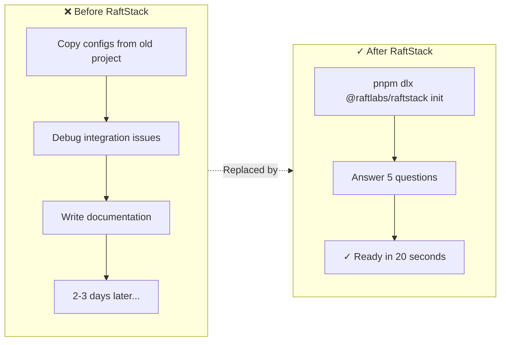
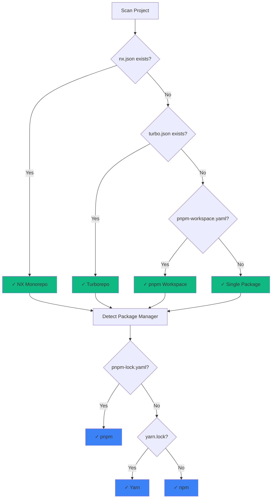
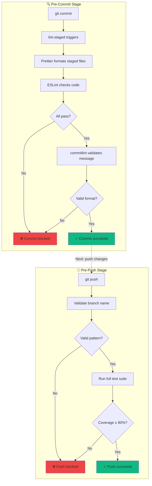
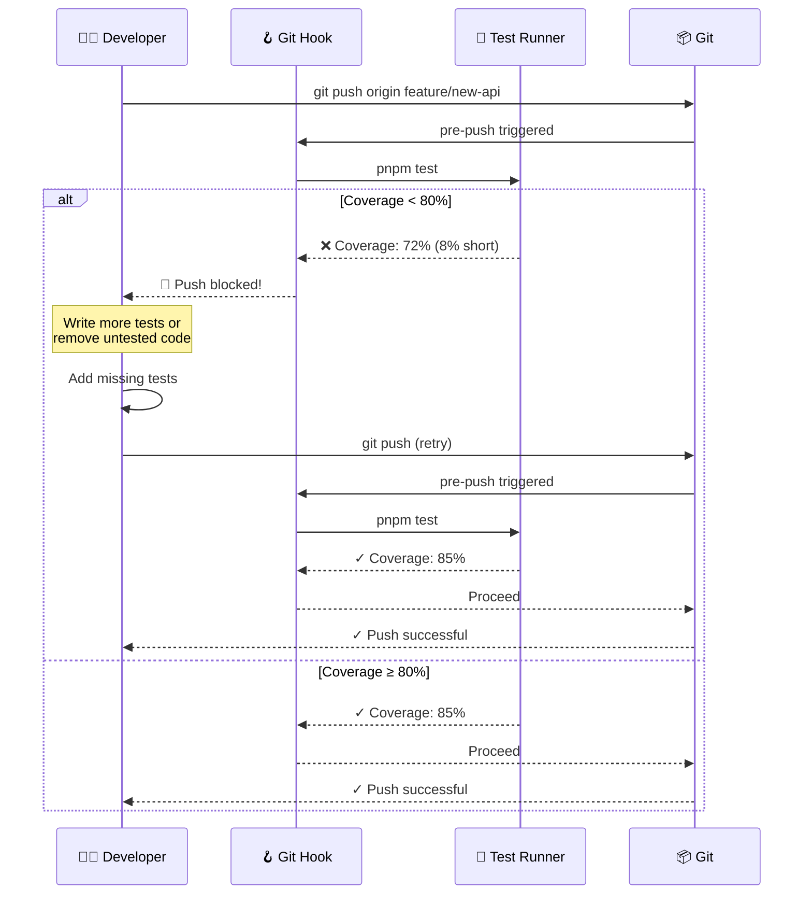
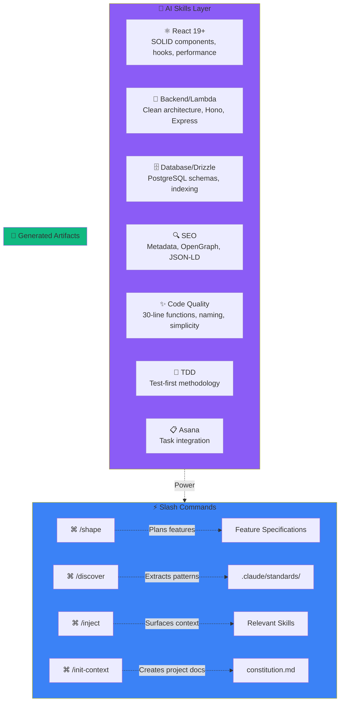

_**Update (February 2026):** This post has been updated to reflect major features added in v1.10+, including TDD enforcement, Claude Code AI integration with 7 domain-specific skills, and the planning protocol framework._

---

Last week, I shipped something that's been brewing in my mind for months: [RaftStack](https://github.com/Raft-Labs/raftstack), an NPM CLI tool that standardizes how we initialize and maintain TypeScript projects at RaftLabs. What started as an idea to improve our development workflow turned into a full development framework that's now adopted by all 30+ engineers in our organization.

Here's the story of why I built it, what problems it solves, and how 20 seconds of setup time now saves us days of repetitive work.

## Why RaftLabs Encouraged This

One thing I love about working at RaftLabs is the culture of continuous improvement. When I pitched the idea of building internal tooling to standardize our workflows, leadership didn't just approve it—they gave me a full week to focus on nothing else. That kind of investment in developer experience is rare, and it's why projects like RaftStack can go from idea to organization-wide adoption so quickly.

RaftLabs has always delivered quality products to clients. But as we scaled from a small team to 30+ engineers, we recognized an opportunity: what if we could make excellence the _default_ rather than something each team had to figure out independently?

## The Challenge: Scaling Engineering Excellence

RaftLabs is a service-based company that builds products for clients—sometimes MVPs that ship in a month, sometimes enterprise projects that span six months or more. We're proud of the diverse, challenging work we take on. At any given time, multiple projects run in parallel, each with its own technical requirements and timelines.

As we grew, we noticed a pattern common to many scaling engineering teams: without explicit standards, each project evolved its own conventions.

### Repository Drift

Different projects had developed different practices. One used 4-space indentation, another used 2. Some had strict TypeScript configurations, others were more relaxed. Commit messages varied from beautifully formatted Conventional Commits to quick notes during crunch time.

Some projects had well-organized Git hooks that validated commits and ran linting. Others—especially older ones or quick prototypes—didn't have these guardrails yet. None of this was due to lack of skill; our engineers are excellent. It was simply a coordination problem that every growing team faces.

### The AI Tooling Opportunity

Here's an industry-wide observation: AI-assisted coding tools dramatically increase development speed, but they also amplify whatever patterns exist in your codebase—good or bad. Across the industry, teams have noticed that without guardrails, AI-generated code can lead to:

- Larger files that could benefit from better separation of concerns
- Relaxed type safety when strict typing would catch bugs earlier
- Bigger pull requests that take longer to review thoroughly

This isn't a criticism of AI tools—we love them and use them daily. It's recognition that _any_ tool that increases output velocity needs corresponding quality gates. The faster you can write code, the more important it becomes to have automated checks ensuring that code meets your standards.

### The Setup Time Sink

The most tangible problem was project initialization. Our engineers—skilled as they are—were spending valuable time on repetitive setup work:

1. Initialize a repo (Turborepo, NX, or similar)
2. Search through previous projects for proven configurations
3. Copy and adapt Husky hooks, Prettier config, ESLint rules
4. Debug integration issues when configs from different sources clashed
5. Document the setup for the team

This process could take **2-3 days** of an engineer's time—time better spent solving actual client problems.

We had talented people doing repetitive work. That's the kind of inefficiency that begs for automation.

### The Developer Workflow: Before vs After

Here's what this problem looked like in practice:



## The Solution: One Command to Rule Them All

With full support from leadership, I set out to solve this properly. Not with documentation alone (though we have that too), not with templates (they drift over time), but with a CLI that makes best practices the path of least resistance.

```bash
pnpm dlx @raftlabs/raftstack init
```

That's it. Run this command in any TypeScript repository, answer a few questions, and in about 20 seconds, your project has:

- **Git Hooks** (Husky) for pre-commit, commit-msg, and pre-push validation
- **Commit Standards** (Commitlint + cz-git) with an interactive commit wizard
- **Code Formatting** (Prettier + lint-staged) that runs on every commit
- **Branch Naming Rules** validated on every push
- **GitHub Integration**: PR templates, CI workflows, CODEOWNERS
- **AI Code Review** configuration (CodeRabbit or GitHub Copilot)
- **Contributing Guidelines** and quick reference documentation

### Smart Detection, Zero Configuration

RaftStack automatically detects your project structure:

- NX workspace? Detected.
- Turborepo? Detected.
- pnpm workspace? Detected.
- Single package? Detected.

It also figures out your package manager (npm, pnpm, or Yarn) and adapts all generated scripts accordingly. No manual configuration needed.



### The Interactive Wizard

Instead of making assumptions, the CLI asks you what you need:

```
? Select your project type: (auto-detected: Turborepo)
? Enable Asana task linking in commits?
? Configure AI code review (CodeRabbit/GitHub Copilot)?
? Set up CODEOWNERS for automatic reviewer assignment?
```

Based on your answers, it generates exactly what you need—nothing more, nothing less.

## What Gets Created

After running the CLI, your project gains this structure:

```
your-project/
├── .husky/
│   ├── pre-commit      # Runs lint-staged & Prettier
│   ├── commit-msg      # Validates commit format
│   └── pre-push        # Validates branch names + TDD enforcement
├── .github/
│   ├── PULL_REQUEST_TEMPLATE.md
│   ├── workflows/pr-checks.yml
│   ├── CODEOWNERS
│   └── QUICK_REFERENCE.md
├── .claude/
│   ├── skills/         # 7 domain-specific AI skills
│   │   ├── react.md
│   │   ├── backend.md
│   │   ├── database.md
│   │   ├── seo.md
│   │   ├── code-quality.md
│   │   ├── tdd.md
│   │   └── asana.md
│   └── commands/       # 8 slash commands
│       ├── shape.md
│       ├── discover.md
│       ├── inject.md
│       └── ...
├── commitlint.config.js
├── .czrc
├── cz.config.js
├── .lintstagedrc.js
├── .prettierrc
├── .prettierignore
└── CONTRIBUTING.md
```

Every file is generated with sensible defaults that work together out of the box.

## Enforcing Quality Through Constraints

The real power isn't in what the CLI creates—it's in what it _prevents_.

### Commit Message Validation

Every commit must follow the Conventional Commits format:

```bash
# This works
git commit -m "feat(auth): add social login support"

# This fails immediately
git commit -m "fixed the thing"
```

No more cryptic commit history. Every commit clearly states what changed and why.

### Branch Name Validation

Push attempts are blocked unless your branch follows the naming convention:

```bash
# This works
git push origin feature/user-authentication

# This is rejected
git push origin my-branch
```

Protected branches (`main`, `develop`, `staging`, `production`) can't be pushed to directly—all changes must go through pull requests.

### Pre-commit Quality Gates

Before any commit succeeds, lint-staged runs Prettier on your staged files. Inconsistent formatting? Fixed automatically. No debates about code style in PRs.

Here's the complete quality gate pipeline:



## The TDD Revolution

The most impactful addition to RaftStack came in v1.10: **TDD enforcement at the Git level**.

### You Can't Push Broken Code Anymore

Here's the problem we noticed: with AI-assisted development accelerating code production, it became easy to push code without running tests. Fast development is great, but not if it means broken tests accumulate in your main branch.

The solution? Make it impossible:



### The 80% Coverage Rule

Every push attempt now runs your full test suite. If coverage drops below 80%, the push is blocked with a clear message:

```bash
❌ Test coverage is below 80% (current: 72%)
Cannot push until coverage improves.
```

This isn't about being strict for the sake of it—it's about maintaining confidence in your codebase. When coverage drops, it's a signal that code was added without thinking through edge cases.

### Enforcing Test-First Development

The pre-push hook enforces what we call the "TDD Checklist":

1. ✅ Tests exist for the feature/fix
2. ✅ Tests fail before implementation (proves they test something real)
3. ✅ Tests pass after implementation
4. ✅ Coverage stays above 80%

This workflow is now automatic. You literally can't skip it, because Git won't let you push.

### TDD Impact

Since adding TDD enforcement:
- **Zero broken builds** pushed to main in the last 2 months
- **Test coverage** across projects: 72% → 87% average
- **Bug detection** shifted left—issues caught before code review
- **Confidence** in refactoring—comprehensive tests act as safety nets

The best part? Developers aren't complaining. They're relieved. Nobody _wants_ to push broken code; they just forget to run tests sometimes. Now Git reminds them.

> **💡 Key Insight**: The 80% coverage rule isn't about hitting a number—it's about enforcing a mindset. When you can't push without tests, you start writing tests _first_ because that's faster than writing code and then scrambling to add tests later. The constraint creates the habit.

## AI-First Development with Claude Code

The second major evolution of RaftStack is its deep integration with Claude Code, Anthropic's official CLI for AI-assisted development.

### The Seven Skills

When you run `raftstack init`, it bundles **7 domain-specific AI skills** that give Claude Code deep knowledge of RaftLabs coding standards:



### How Skills Work

Think of skills as "expert knowledge modules" that Claude Code automatically loads when relevant. For example:

**When writing a React component**, the `react.md` skill activates, reminding Claude about:
- React 19+ patterns (no more `React.FC`)
- SOLID principles for component design
- When to use Server vs Client components
- Performance optimization strategies

**When writing a Lambda function**, the `backend.md` skill enforces:
- Clean architecture patterns
- Proper error handling for serverless
- Zod validation at API boundaries
- Service layer separation

These aren't just guidelines—they're active constraints that Claude Code follows during code generation.

#### Before vs After: React Component Generation

**Without RaftStack skills:**

```tsx
// Generic AI-generated component
import React from 'react';

const UserCard: React.FC<{ user: any }> = ({ user }) => {
  const [loading, setLoading] = React.useState(false);

  const handleClick = () => {
    setLoading(true);
    // ... 50 lines of mixed concerns
    setLoading(false);
  };

  return <div onClick={handleClick}>{user.name}</div>;
};
```

**With RaftStack skills:**

```tsx
// RaftLabs-standard component
interface UserCardProps {
  user: User; // Typed, not `any`
  onSelect: (id: string) => Promise<void>;
}

// No React.FC (React 19+ pattern)
export function UserCard({ user, onSelect }: UserCardProps) {
  const [isLoading, setIsLoading] = useState(false);

  // Extracted to custom hook for reusability
  const { handleSelect } = useUserSelection(user.id, onSelect);

  return (
    <button onClick={handleSelect} disabled={isLoading}>
      {user.name}
    </button>
  );
}
```

The difference? The skill enforces:
- No `React.FC` (React 19+ convention)
- Strict typing (no `any`)
- Single responsibility (selection logic extracted to hook)
- Semantic HTML (`button` not `div` for clickable elements)

### The Planning Protocol

Perhaps the most powerful workflow is the **planning protocol**, enforced through the `/shape` command and `_planning-protocol` skill:

**Before writing any feature code**, Claude Code must:

1. **Understand the problem** - Clarify requirements through questions
2. **Explore existing patterns** - Search the codebase for similar implementations
3. **Design the solution** - Create a step-by-step implementation plan
4. **Get approval** - Present the plan to you for sign-off
5. **Execute with checkpoints** - Implement with regular verification

This prevents the "AI hallucination" problem where Claude starts writing code before understanding your codebase. It forces deliberate planning before implementation.

### The Shape Command: Adaptive Depth

The `/raftstack/shape` command adapts to task complexity:

**Quick Flow** (1-2 file changes):
```bash
/raftstack/shape "add a loading spinner to the button"
```
→ Minimal planning, fast implementation

**Light Spec** (3-5 files, single feature):
```bash
/raftstack/shape "add user authentication"
```
→ Brief spec, identifies key files, then implements

**Full Spec** (6+ files, architectural changes):
```bash
/raftstack/shape "migrate from REST to tRPC"
```
→ Comprehensive planning, architecture review, approval gate

The deeper the change, the more Claude Code forces you to think through the design before touching code.

### Slash Commands in Action

Here are the 8 commands bundled with RaftStack:

| Command | Purpose |
|---------|---------|
| `/raftstack/shape` | Plan and implement features with adaptive depth |
| `/raftstack/discover` | Extract coding patterns from existing code → `.claude/standards/` |
| `/raftstack/inject` | Surface relevant skills/context based on current task |
| `/raftstack/init-context` | Create project constitution (vision, standards, architecture) |
| `/raftstack/index` | Index and organize discovered standards |
| `/raftstack/migrate-configs` | Migrate monorepo configs to shared packages |
| `/raftstack/help` | Interactive guide to all RaftStack features |
| `/raftstack/_planning-protocol` | Enforce approval gates before implementation |

These commands turn Claude Code from a "smart autocomplete" into a **structured development partner** that follows your team's conventions automatically.

### Real Example: Shaping a Feature

Here's what happens when you run `/raftstack/shape "add pagination to the users table"`:

1. **Claude analyzes** your codebase to find existing pagination patterns
2. **Asks clarifying questions**: "Should this be cursor-based or offset pagination?"
3. **Creates a spec**:
   - Files to modify: `src/components/UsersTable.tsx`, `src/api/users.ts`
   - New types: `PaginationParams`, `PaginatedResponse<User>`
   - Testing strategy: Unit tests for API, integration test for UI
4. **Presents the plan** for your approval
5. **Executes step-by-step** with test-driven development

You get to review the architecture _before_ Claude writes hundreds of lines of code. This prevents wasted work and ensures consistency with your codebase.

> **💡 Key Insight**: AI tools are incredibly powerful at writing code, but terrible at choosing _what_ to write. The planning protocol inverts this: you guide the architecture, Claude handles the implementation. This is the division of labor that actually works.

### Installing Skills Without Full Setup

In v1.10.1, we added the `install-commands` command for projects that already have RaftStack but want to update their skills:

```bash
pnpm dlx @raftlabs/raftstack install-commands
```

This updates `.claude/skills/` and `.claude/commands/` without touching your existing Git hooks or configs. Perfect for staying up-to-date as we add new skills and commands.

## The Bigger Picture: A Complete Development Framework

RaftStack isn't meant to work alone. It's part of a comprehensive project setup workflow that our senior engineers collaboratively developed:

1. **Tech Lead Consultation** — Discuss and document stack decisions before writing any code
2. **Repository Initialization** — Use Better-T-Stack, Turborepo, or AWS Amplify based on project needs
3. **Organization Standards** — Run `@raftlabs/raftstack init`
4. **Environment Management** — Secure environment variables with EnvX encryption
5. **AI Development Setup** — Initialize Claude Code with bundled skills for consistent AI-assisted development

This framework gives every engineer a clear, proven path from zero to productive. It's not about restricting creativity—it's about eliminating the boring parts so engineers can focus on solving interesting problems for our clients.

## Metrics: Measuring What Matters

The CLI includes a `metrics` command that helps teams understand their repository health:

```bash
pnpm dlx @raftlabs/raftstack metrics
```

This shows:

- Percentage of commits following Conventional Commits
- Branch naming compliance
- Files that would fail lint checks
- Overall "health score" for the repository

This isn't about policing—it's about visibility. Teams can see where they stand and track improvement over time. It's been particularly useful for onboarding new team members to existing projects, giving them instant insight into the codebase conventions.

## The Impact

After rolling this out organization-wide (v1.0 in January 2025, v1.10 in December 2025), we've seen:

### Efficiency Gains
- **Project setup time**: 2-3 days → 20 seconds
- **Commit message quality**: Drastically improved, with clear history across all projects
- **PR review time**: Reduced because changes are smaller and better documented
- **Onboarding time**: New engineers get productive faster because every project works the same way
- **Code review friction**: Eliminated debates about formatting—it's all automated

### Quality Improvements (v1.10+)
- **Test coverage**: 72% → 87% average across projects
- **Broken builds pushed to main**: ~2-3 per week → 0 in the last 2 months
- **Time to detect bugs**: Shifted left—caught before code review instead of in production
- **AI-generated code quality**: Skills enforce RaftLabs patterns automatically

### Developer Experience
- **Confidence in refactoring**: Comprehensive tests act as safety nets
- **Consistency across projects**: Every repo follows the same patterns
- **Planning quality**: `/shape` command forces deliberate design before implementation
- **Context retention**: `.claude/standards/` captures institutional knowledge

But the biggest win? **Confidence**. When I look at any RaftLabs repository now, I know exactly what I'll find. The same hooks, the same commit format, the same branch naming, the same PR templates, the same test coverage standards, and the same AI-enforced coding patterns. It just works.

## Try It Yourself

RaftStack is open source and works with any TypeScript project:

```bash
# Full setup: Git hooks, commit standards, AI skills
pnpm dlx @raftlabs/raftstack init

# Update Claude Code skills only (for existing RaftStack projects)
pnpm dlx @raftlabs/raftstack install-commands

# Setup GitHub branch protection rules
pnpm dlx @raftlabs/raftstack setup-protection

# Check repository compliance & test coverage
pnpm dlx @raftlabs/raftstack metrics
```

Check out the [GitHub repository](https://github.com/Raft-Labs/raftstack) for full documentation, or install it directly from [NPM](https://www.npmjs.com/package/@raftlabs/raftstack).

### Using Claude Code Skills

Once installed, use the skills in [Claude Code](https://claude.ai/code):

```bash
# Plan a feature with adaptive depth
/raftstack/shape "add real-time notifications"

# Extract patterns from your codebase
/raftstack/discover

# Initialize project context for AI
/raftstack/init-context
```

The skills work seamlessly—Claude Code automatically applies RaftLabs standards to any code it generates.

---

## What's Next

RaftStack continues to evolve. Here's what's on the roadmap:

- **Monorepo config migration** - Standardize shared ESLint/TypeScript configs across workspaces
- **Enhanced metrics** - Visualize test coverage trends over time
- **Custom skill templates** - Let teams define their own domain-specific skills
- **IDE integrations** - VS Code extension for instant access to `/shape` and other commands

---

Building developer tools that save time is satisfying, but building tools that improve _quality_ across an entire organization? That's a different level of impact.

I'm grateful to work at a company that values engineering excellence enough to invest in internal tooling. RaftLabs gave me the time and trust to build something that benefits every engineer and every client project we deliver.

If your team is growing and noticing similar coordination challenges, consider whether better tooling might help. It's not about discipline—it's about making the right thing the easy thing. And in 2026, "the right thing" includes AI that understands your team's standards, Git hooks that enforce test coverage, and a 20-second setup that makes excellence automatic.

Sometimes the best code you write is the code that writes code. And sometimes the best tool you build is the one that makes it impossible to ship bad code.
